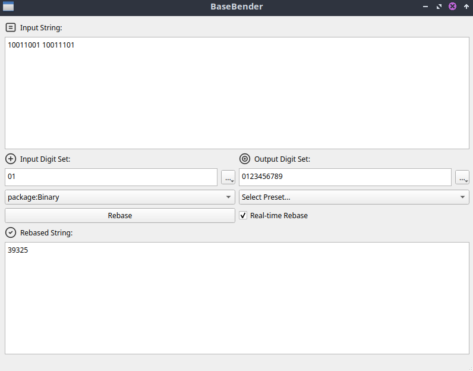

# BaseBender

This project provides a Python module for rebaseing strings between different digit sets (positional number systems). It also includes a command-line interface (CLI) for easy usage.



## Project Goal
n
The primary goal is to provide a flexible and efficient tool for rebaseing numbers between different digit sets.

## Features

*   **Flexible Digit Set Definition**: Define source and target digit sets using simple strings, supporting rebaseing between standard and non-standard positional number systems (e.g., different Unicode symbol sets of varying lengths).
*   **Tiered Configuration for Digit Sets**: Load pre-defined digit sets from package, system, and user-specific TOML configuration files, allowing for easy extension and customization.
*   **Intelligent Digit Set Discovery**: Suggests relevant pre-defined digit sets based on the input string's content, enhancing usability for the GUI.
*   **Dynamic Input Digit Set**: Automatically derives the input digit set from the input string if not explicitly provided. In the GUI, selecting "Derived from Input" from the preset dropdown will populate the input digit set field with the currently derived digit set. When the input digit set field is empty and the input string is not empty, its placeholder text will dynamically display the derived digit set from the input string, along with a visual cue. If both the input string and input digit set field are empty, the default placeholder text will be shown.
*   **Efficient Rebaseing**: Utilizes bit-packing to minimize space during intermediate rebase.
*   **Enhanced Error Handling**: Provides clear and informative error messages across CLI, API, and GUI, with structured error responses for the API.
*   **Command-Line Interface (CLI)**: Rebase strings directly from the terminal with improved help text and error reporting.
*   **Graphical User Interface (GUI)**: An intuitive interface for rebaseing, featuring digit set manipulation, tooltips, and a clear status bar for error messages.
*   **Flexible Rebase Behavior**: Handles empty input strings, empty output digit sets, and single-character output digit sets gracefully.

## Installation

1.  **Clone the repository**:
    ```bash
    git clone https://github.com/mexc/base-bender.git
    cd base-bender
    ```

2.  **Install Poetry**:
    If you don't have Poetry installed, follow the instructions on its official website: [https://python-poetry.org/docs/#installation](https://python-poetry.org/docs/#installation)

3.  **Install dependencies using Poetry**:
    ```bash
    poetry install
    ```
    This will create a virtual environment and install all project dependencies, including `pytest` and `toml`.

    After installing dependencies, run the update script to generate the GUI asset source files:

    ```bash
    ./bin/update
    ```

## Configuration

The BaseBender supports loading pre-defined digit sets from tiered TOML configuration files. This allows for a flexible and extensible way to manage common digit sets.

### Configuration File Locations (in order of precedence: User > System > Package)

*   **Package Configuration**:
    *   Location: `rebaser/resources/data/default_digit_sets.toml` within the installed package.
    *   Purpose: Contains a comprehensive set of standard, built-in digit sets (e.g., Binary, Decimal, Hexadecimal, Base64, ASCII Printable).
    *   Example content:
        ```toml
        [[digit_sets]]
        name = "Binary"
        digits = "01"

        [[digit_sets]]
        name = "Decimal"
        digits = "0123456789"
        ```

*   **System Configuration**:
    *   Location (Linux/macOS): `/etc/digit_set_rebaser/digit_sets.toml`
    *   Location (Windows): `%PROGRAMDATA%\digit_set_rebaser\digit_sets.toml`
    *   Purpose: Allows system administrators to define digit sets available to all users on the system.

*   **User Configuration**:
    *   Location (Linux/macOS): `~/.config/digit_set_rebaser/digit_sets.toml`
    *   Location (Windows): `%APPDATA%\digit_set_rebaser\digit_sets.toml`
    *   Purpose: Allows individual users to define their own custom digit sets or override system/package defaults.

### Adding Custom Digit Sets

To add your own custom digit sets, create or edit the `digit_sets.toml` file in your user configuration directory (or system directory for system-wide availability). Follow the TOML format shown in the example above. Digit sets defined in higher precedence tiers will override those with the same `name` in lower tiers.

## Usage

For detailed CLI usage examples, refer to [CLI Examples](docs/cli_examples.md).
For detailed API usage examples, refer to [API Examples](docs/api_examples.md).

## Running Tests

To run the unit tests, use Poetry:

```bash
poetry run pytest
```

## Project Structure

This project is organized into several key directories and files at the root level. For detailed descriptions of files within subdirectories, please refer to their respective `STRUCTURE.md` files:

*   [bin/](bin/STRUCTURE.md) - Contains utility scripts for project setup and updates.
*   [docs/](docs/STRUCTURE.md) - Houses documentation files, including API and CLI usage examples.
*   [src/](src/STRUCTURE.md) - Contains the core source code for the application, including API, CLI, GUI, and rebaser logic.
*   [tests/](tests/STRUCTURE.md) - Holds unit tests for the project's modules.

### Root Level Files:

*   `.gitattributes`: Configures Git attributes for various paths.
*   `.gitignore`: Specifies intentionally untracked files to ignore.
*   `.pre-commit-config.yaml`: Configuration for pre-commit hooks to enforce code quality.
*   `.pylintrc`: Configuration file for Pylint, a Python static code analysis tool.
*   `CONTRIBUTING.md`: Guidelines for contributing to the project.
*   `LICENSE`: The project's license file (MIT License).
*   `README.md`: The main project README, providing an overview and entry point.
*   `poetry.lock`: Locks the exact versions of project dependencies.
*   `pyproject.toml`: Project metadata and dependencies managed by Poetry.

## Contributing

Contributions are welcome! Please refer to the [Contribution Guidelines](CONTRIBUTING.md) for more details.

## License

This project is licensed under the [MIT License](LICENSE).
